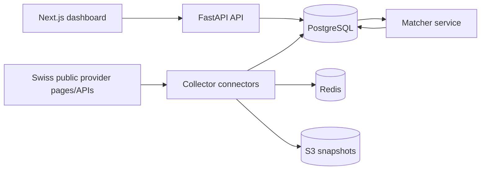

# Swiss Phone Price Intelligence MVP

Internal competitive intelligence platform for public Swiss refurbished / second-hand / buyback phone pricing.

## Milestone 1 deliverables

### Proposed repo structure

```text
.
├── AGENTS.md
├── PLANS.md
├── docs/
│   ├── ARCHITECTURE.md
│   ├── CONNECTORS.md
│   └── KNOWN_LIMITATIONS.md
├── apps/web
├── services/api
├── services/collector
├── services/matcher
├── services/common
├── packages/shared
├── infrastructure
├── alembic
├── docker-compose.yml
└── Makefile
```

### Architecture (Mermaid)



### PostgreSQL schema

Core tables:
- providers
- provider_configs
- scrape_runs
- scrape_errors
- raw_offers
- normalized_offers
- canonical_phones
- price_history
- manual_match_reviews
- buyback_quotes
- connector_health_snapshots

## Milestone 2 deliverables

- Collector, matcher, API and web scaffolding.
- Connector registry with Swiss provider-oriented connectors.
- Docker compose local stack (`postgres`, `redis`, `api`, `collector`, `web`).
- Shared normalization/database modules.

## Implemented providers and support level

- FULL_SUPPORT: Revendo, refurbed.ch, Back Market CH
- PARTIAL_SUPPORT (scaffolded): Digitec Secondhand, Galaxus Refurbished
- LIMITED_SUPPORT (scaffolded): MediaMarkt Refurbished
- Additional tiered providers are seeded in config for future implementation.

## Guardrails

- Public pages/data only.
- Respect robots, crawl-delay, throttling, retries.
- No login/cart/checkout/CAPTCHA bypass/stealth automation.
- Mark providers LIMITED_SUPPORT when robust public extraction is not feasible.

## Setup

```bash
cp .env.example .env
make setup
docker compose up --build
make migrate
make seed
```

API docs: `http://localhost:8000/docs`
Web app: `http://localhost:3000`

## Commands

```bash
make setup
make dev
make test
make lint
make seed
make migrate
```

## Detailed run instructions

For a step-by-step runbook (prereqs, env setup, docker startup, migrations, seed, smoke tests, troubleshooting), see:

- `docs/RUNBOOK.md`

Quick commands:

```bash
cp .env.example .env
make setup
make dev
make migrate
make seed
```

