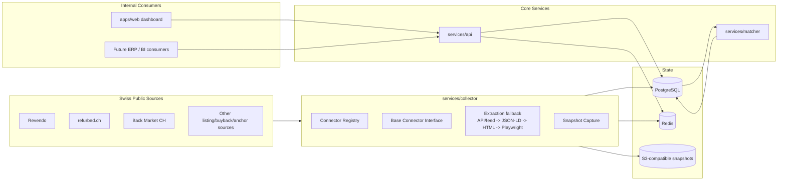

# Architecture

## Schema summary

Main entities:
- providers / provider_configs
- scrape_runs / scrape_errors / connector_health_snapshots
- raw_offers / normalized_offers / price_history
- canonical_phones / manual_match_reviews
- buyback_quotes
